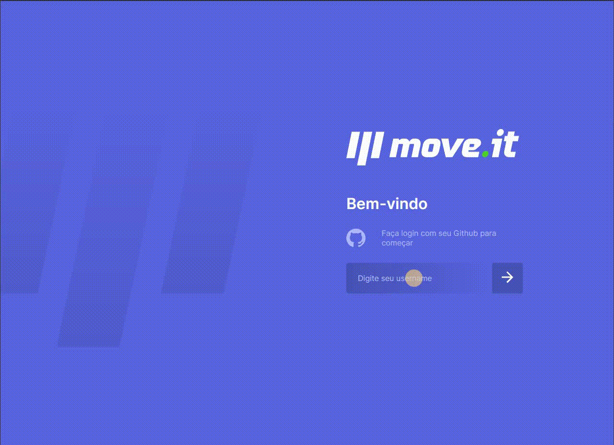

<h1 align="center">
  
  <small>NLW</small>
</h1>

<h3 align="center"> Projeto proposto na NLW pela <strong>Rocketseat</strong> e tem como objetivo juntar o mundo dos games com a saúde do desenvolvedor. Inspirada na técnica do Pomodoro, o jogo permite que avancemos de nível a medida que é cumprido os exercícios informados.</h3>

<br />

<br />

<h1> Animação <h1>




# ⚙️ Ferramentas utilizadas no projeto

- [Next.js](https://nextjs.org/)
- [React](https://pt-br.reactjs.org/)
    - ApiContext
    - useRouter
    - js-cookie
    - CSS avançado
    - Validação de Login
- [TypeScript](https://www.typescriptlang.org/)
- [Entity Framework](https://docs.microsoft.com/pt-br/ef/)
- [SQL Server](https://www.microsoft.com/pt-br/sql-server/)

<br />

# 👨‍💻 Desenvolvimento

Para iniciar o desenvolvimento, é necessário clonar o repositório em um diretório de sua preferência:

```bash
cd ../minha-pasta
git clone https://github.com/gtvilela/moveit.git
cd moveit
```

Instale as dependências necessárias para o correto funcionamento da aplicação:

```bash
npm install
```

<br />

# ☁️ Deploy e Publicação
Aplicação: [Moveit](https://moveit-cyan-two.vercel.app/)

Plataforma: [Vercel](https://vercel.com/new?utm_medium=default-template&filter=next.js&utm_source=create-next-app&utm_campaign=create-next-app-readme)

<br />

